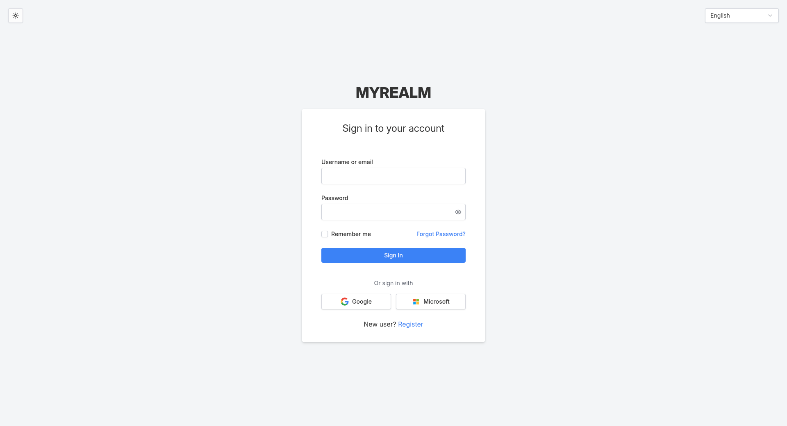
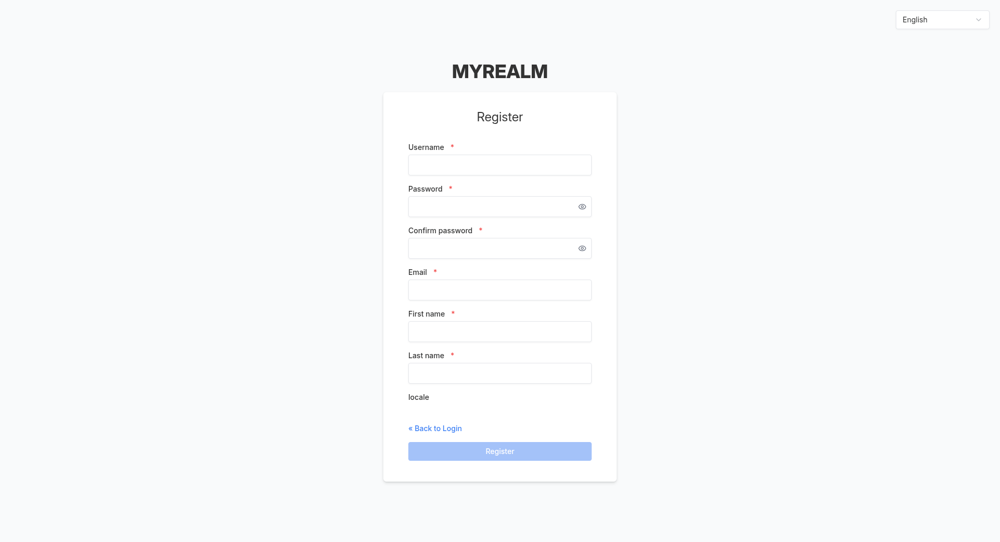

# Shadcn Keycloak Theme

> [!WARNING]
> This project is actively in development. Features and APIs may change without notice.

[](https://github.com/ThilinaTLM/keycloak-shadcn-theme/actions/workflows/code-quality.yml)
[](https://github.com/ThilinaTLM/keycloak-shadcn-theme/actions/workflows/release.yml)

<div align="center">
  
  <p><em>Transform your Keycloak authentication with modern design</em></p>
  <p>
    <a href="#-quick-demo">Try It Now</a> •
    <a href="#-quick-start">Get Started</a> •
    <a href="#-features">Features</a> •
    <a href="DEVELOPMENT.md">Developer Guide</a>
  </p>
</div>

---

A modern, beautiful, and fully customizable Keycloak login theme built with [Keycloakify v11](https://www.keycloakify.dev/), [React](https://react.dev/), [TypeScript](https://www.typescriptlang.org/), [shadcn/ui](https://ui.shadcn.com/), and [Tailwind CSS v4](https://tailwindcss.com/). This theme provides a responsive, accessible, and internationalized user interface for all Keycloak authentication flows.

## 📑 Table of Contents

- [Why Use This Theme?](#-why-use-this-theme)
- [Quick Demo](#-quick-demo)
- [Use Cases](#-use-cases)
- [Features](#-features)
- [Screenshots](#-screenshots)
- [Quick Start](#-quick-start)
- [Activating the Theme](#-activating-the-theme)
- [Developer Guide](#-developer-guide)
- [Roadmap](#%EF%B8%8F-roadmap)
- [License](#-license)

## 💡 Why Use This Theme?

Keycloak's default login theme is functional but often feels outdated and doesn't match modern web application standards. This theme bridges that gap by providing:

- **Modern Design Language**: Clean, contemporary UI that matches today's web applications, not enterprise software from 2010
- **Developer-First Experience**: Built with React and TypeScript, making customization intuitive for modern web developers
- **Production-Ready Components**: Leverages battle-tested shadcn/ui components and Tailwind CSS, eliminating the need to build UI from scratch
- **Accessibility by Default**: WCAG-compliant components ensuring your authentication flows are usable by everyone
- **Easy Maintenance**: Clear component structure and excellent tooling (Storybook, TypeScript) makes updates and customization straightforward
- **Full Coverage**: Every authentication page is styled consistently - no half-finished themes or missing pages

Whether you're building a SaaS platform, enterprise application, or consumer-facing product, your login experience is often the first impression users have. Make it count.

## 🚀 Quick Demo

Want to see the theme in action without setting up Keycloak? Try it instantly with Storybook:

```bash
# Clone and preview in ~30 seconds
npx degit ThilinaTLM/keycloak-shadcn-theme my-keycloak-theme
cd my-keycloak-theme
pnpm install
pnpm storybook
```

This will open an interactive playground where you can explore all authentication pages, test different states, and see the theme in action at http://localhost:6006.

## 🎯 Use Cases

### Perfect For:

- **SaaS Platforms**: Modern authentication that matches your application's design language
- **Enterprise Applications**: Professional, accessible login flows that meet compliance requirements
- **Customer-Facing Products**: Beautiful first impressions with branded authentication experiences
- **Developer Teams**: React/TypeScript developers who want to customize without learning Freemarker templates
- **Design-Conscious Projects**: Teams that care about UX/UI and want a modern alternative to default Keycloak themes

### When to Choose This Theme:

- You need a modern, professional login experience out of the box
- Your team is comfortable with React and wants easy customization
- You want to match your authentication UI with your application's design system
- You need comprehensive coverage of all Keycloak authentication flows
- You value developer experience and maintainability

## ✨ Features

### 🎨 Modern Design System

- **shadcn/ui Components**: Built with high-quality, accessible React components
- **Tailwind CSS v4**: Latest styling with CSS custom properties and improved performance
- **Geist Font**: Modern typography using the Geist font family
- **Responsive Design**: Mobile-first approach with responsive layouts
- **Dark/Light Mode Ready**: Theme structure supports multiple color schemes

### 🔐 Complete Authentication Coverage

This theme supports **all essential Keycloak login pages**:

**Core Authentication:**

- Login (username/password)
- Registration
- Password Reset & Update
- Email Verification
- Logout Confirmation

**Multi-Factor Authentication:**

- OTP/TOTP Configuration & Input
- Recovery Authentication Codes
- WebAuthn/Passkeys Support
- X.509 Certificate Authentication

**Advanced Flows:**

- OAuth Grant Confirmation
- OAuth Device Authorization
- Identity Provider Linking
- User Profile Management
- Account Deletion Confirmation
- Terms and Conditions
- Error & Info Pages

### 🌐 Internationalization

- **30+ Languages Supported**: Complete message bundles for global deployment
- **RTL Support**: Right-to-left languages fully supported
- **Custom Messages**: Easy to extend with additional languages

### 🛠️ Developer Experience

- **TypeScript**: Full type safety throughout the codebase
- **Storybook**: Interactive component development and testing
- **ESLint + Prettier**: Code quality and consistent formatting
- **Docker Compose**: Full development environment with one command
- **Hot Reload**: Instant feedback during development

## 📸 Screenshots

### Login Page


Clean, modern login interface with support for multiple authentication providers including social logins (Google, Microsoft), featuring contemporary design with excellent spacing and typography.

### Registration Page



Streamlined registration form with clear field labels, validation, and consistent styling that matches the overall design system.

### Required Actions


Clear, user-friendly messaging for required actions with intuitive call-to-action buttons and helpful guidance text.

## 🚀 Quick Start

Get up and running with the Shadcn Keycloak Theme in minutes.

### 1. Download the Pre-built Theme

Visit the [GitHub Releases](https://github.com/ThilinaTLM/keycloak-shadcn-theme/releases) page and download `shadcn-theme.jar` from the latest release.

### 2. Install to Keycloak

Copy the JAR file to your Keycloak providers directory:

```bash
cp shadcn-theme.jar $KEYCLOAK_HOME/providers/
```

For Docker deployments, you can mount the JAR file:

```dockerfile
FROM quay.io/keycloak/keycloak:latest
COPY shadcn-theme.jar /opt/keycloak/providers/
RUN /opt/keycloak/bin/kc.sh build
```

### 3. Restart Keycloak

Restart your Keycloak instance to load the new theme:

```bash
$KEYCLOAK_HOME/bin/kc.sh start
```

Or with Docker:

```bash
docker restart <keycloak-container>
```

## 🎨 Activating the Theme

After installation, configure your realm to use the new theme:

1. **Log in to Keycloak Admin Console**

   - Navigate to `http://your-keycloak-url/admin`

2. **Select your Realm**

   - Choose the realm you want to apply the theme to

3. **Configure Theme Settings**

   - Go to **Realm Settings** → **Themes** tab
   - Under **Login Theme**, select `shadcn-theme` from the dropdown
   - Click **Save**

4. **Test the Theme**
   - Log out from the admin console
   - Visit your application's login page
   - You should now see the modern Shadcn theme

That's it! Your Keycloak instance now has a modern, beautiful login experience.

## 👨‍💻 Developer Guide

Want to customize the theme or contribute to development?

Check out the [DEVELOPMENT.md](DEVELOPMENT.md) guide for:

- **Development Setup**: Prerequisites, installation, and local environment
- **Project Architecture**: Understanding the codebase structure
- **Component Development**: Creating and customizing pages
- **Theme Customization**: Styling, fonts, and internationalization
- **Testing**: Storybook and Docker testing workflows
- **Contributing**: Guidelines for contributing to the project

## 🗺️ Roadmap

- [ ] Admin theme implementation
- [ ] Dark mode toggle
- [ ] Additional language support
- [ ] Custom branding system
- [ ] Advanced form validation
- [ ] Performance optimizations
- [ ] Accessibility improvements
- [ ] Additional shadcn/ui components

## 📄 License

This project is licensed under the MIT License - see the [LICENSE](LICENSE) file for details.

## 🙏 Acknowledgments

- [Keycloakify](https://www.keycloakify.dev/) - For the amazing Keycloak theme framework
- [shadcn/ui](https://ui.shadcn.com/) - For the beautiful component system
- [Tailwind CSS](https://tailwindcss.com/) - For the utility-first CSS framework
- [Geist Font](https://vercel.com/font) - For the modern typography

---

Built with ❤️ using modern web technologies. Star ⭐ the repo if you find it useful!
